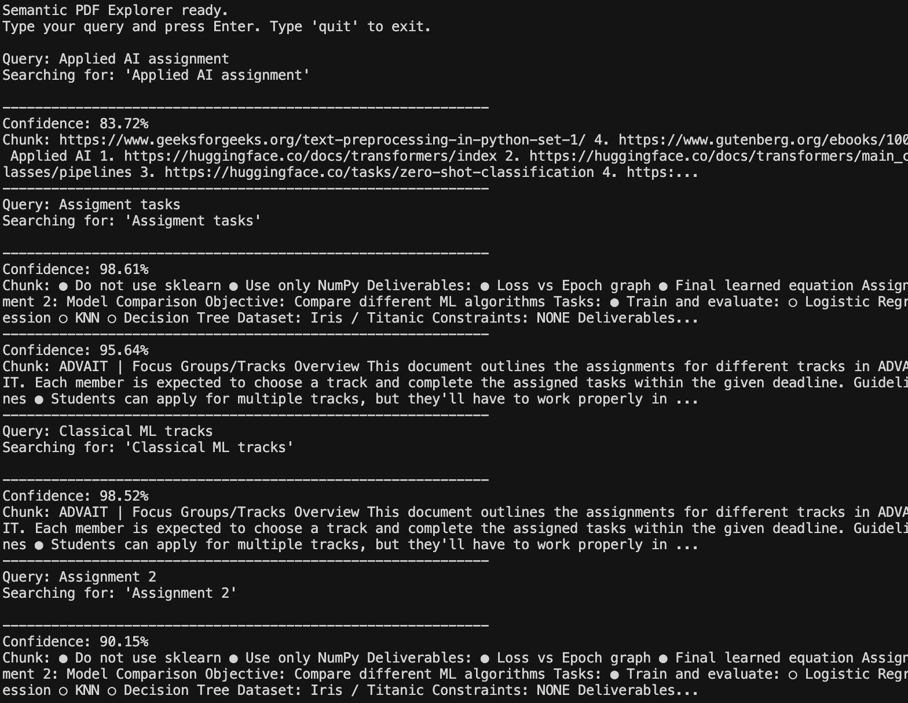

# Semantic PDF Explorer

A CLI tool that lets you search through a PDF using natural language queries. Instead of keyword matching, it uses AI to understand the *meaning* of your query and returns the most relevant sections of the document.

## What it does

- Extracts text from any PDF file
- Splits the text into chunks of ~200 words
- Uses HuggingFace's zero-shot classification model (`facebook/bart-large-mnli`) to compare your query against each chunk
- Returns chunks with confidence scores above 80%

## Pipeline
```
PDF → Text Extraction (pypdf) → Chunking → Zero-Shot Classification (HuggingFace) → Filtered Results
```

## How to run

**1. Clone the repo**
```
git clone <your-repo-url>
cd semantic-pdf-explorer
```

**2. Create and activate virtual environment**
```
python3 -m venv venv
source venv/bin/activate
```

**3. Install dependencies**
```
pip install -r requirements.txt
```

**4. Run the script**
```
python3 explorer.py
```

**5. Enter the path to your PDF when prompted, then type your queries**

## Sample queries and outputs

**Query:** `Assignment tasks`



## Approach

1. Used `pypdf` to extract raw text from the PDF page by page
2. Split the full text into chunks of 200 words each to keep inputs within model limits
3. Loaded `facebook/bart-large-mnli` — a transformer model trained on natural language inference
4. For each query, ran zero-shot classification treating the query as a candidate label
5. Filtered and sorted results by confidence score, displaying only chunks above 80%

## Difficulties faced

- **File path with quotes** — drag and drop on Mac wraps paths in single quotes, causing `FileNotFoundError`. Fixed by adding `.strip("'\"")` to clean the input, or if not that then just make sure the name of the pdf you're uploading does not have soaces in it like mine did.

## Learnings

- How transformer models work at a high level — specifically zero-shot classification
- How to use HuggingFace pipelines without training a model from scratch
- Virtual environments and dependency management in Python
- How semantic search differs from keyword search

## Tech stack

- Python 3.13
- pypdf
- HuggingFace Transformers
- PyTorch
- facebook/bart-large-mnli
